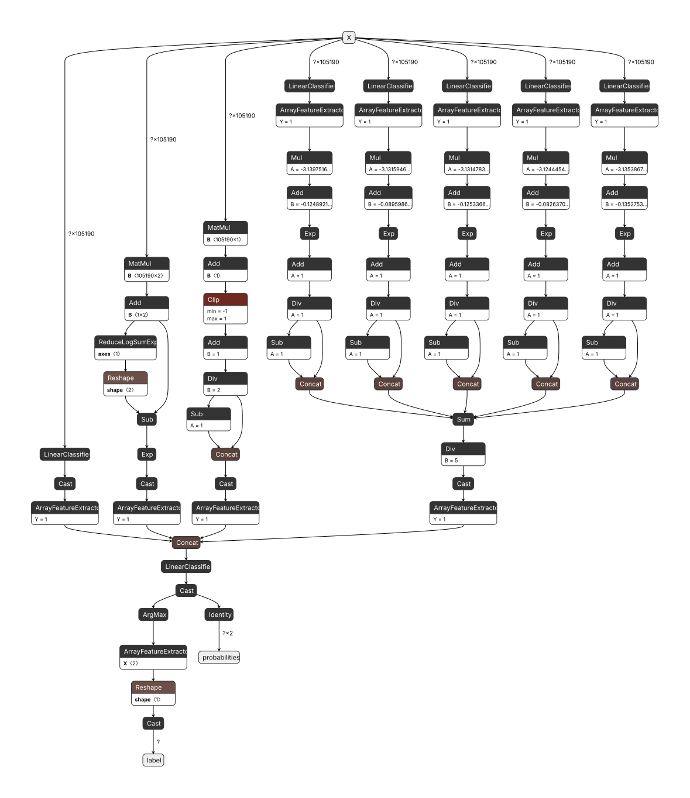

<div align=center>


[](https://crates.io/crates/is-it-slop)
[](https://crates.io/crates/is-it-slop)
[](https://docs.rs/crate/is-it-slop/latest)

[](https://pypi.org/project/is-it-slop/)
[](https://pypi.org/project/is-it-slop/)
[](./LICENSE)

</div>

---

# is-it-slop

***Unsure if the article you just read was AI generated slop?***

`is-it-slop` is a small, fast, and accurate text classification tool that detects AI-generated.

Fast AI text detection using classic ML - TF-IDF and logistic regression on token n-grams.

> Inspired by [Magika](https://github.com/google/magika) for serving a small, fast model via ONNX Runtime in Rust.

## Features

- **Fast**: Rust-based multi-threaded preprocessing and batch inference via ONNX Runtime
- **Small**: 7.2 MB model + 4.2 MB vectorizer (~11.4 MB total), no transformers or GPU needed
- **Portable**: Single ~60 MB binary with embedded model, no Python runtime required
- **Accurate**: 95.6% accuracy (F1 0.96, MCC 0.91) on diverse holdout test sets
- **Chunk-aware**: Handles long documents via overlapping token chunks with aggregation

## Installation

### CLI

**Option 1: Pre-built binaries** (fastest, no build required):

```bash
# Using cargo-binstall (recommended for Rust users)
cargo binstall is-it-slop
```

**Option 2: Via Python package**:

```bash
pip install is-it-slop
# or
uv add is-it-slop
# or run directly without installing:
uvx is-it-slop "Your text here"
```

**Option 3: Build from source**:

```bash
cargo install is-it-slop --locked --features cli
```

Model artifacts (~7.4 MB) download automatically during build and are embedded in the binary.

### Python Library

```bash
uv add is-it-slop
```

or using pip:

```bash
pip install is-it-slop
```

### Rust Library

```bash
cargo add is-it-slop
```

## Quick Start

### CLI

Both Python and Rust installations provide the same `is-it-slop` command:

```bash
# Default: human-readable with probabilities and confidence metrics
is-it-slop "Your text here"

# Classification label only
is-it-slop "Text" --label
# Output: Human (or AI)

# Full JSON output
is-it-slop "Text" --json

# Bare AI probability score for scripting
is-it-slop "Text" --score
# Output: 0.2340

# Batch from file (auto-detects .json vs line-delimited)
is-it-slop -b texts.txt

# Run directly with uvx (no installation needed):
uvx is-it-slop "Your text here"
```

### Python Library

```python
from is_it_slop import is_this_slop

result = is_this_slop("Your text here")
print(result.classification)  # 'Human' or 'AI'
print(f"AI probability: {result.ai_probability:.2%}")
```

### Rust

```rust
use is_it_slop::Predictor;

let predictor = Predictor::new();
let result = predictor.predict("Your text here")?;
println!("AI probability: {:.2}%", result.prediction.ai_probability() * 100.0);
```

## How It Works

**Training (Python):**

```
Texts (HuggingFace Datasets) → Clean → Tokenize → Chunk → TF-IDF → Logistic Regression → ONNX
```

**Inference (Rust):**

```
Text → Clean → Tokenize → Chunk (150 tokens, 15 overlap)
     → TF-IDF per chunk → ONNX → Aggregate predictions → Result
```

### Why BPE Tokenization?

We use tiktoken's BPE tokenization (o200k_base) to convert text into token sequences. This allows us to capture subword information and create token n-grams without having to deal with creating a custom tokenizer (where BPE tokenization handles edge cases and is widely used in LLMs).

> The idea here is that LLMs operate on tokens, and token-level n-grams can capture patterns that character or word n-grams might miss, especially for AI-generated text. Humans often have more varied token usage, while AI-generated text may have more predictable token sequences.

### Why Chunking?

Variable-length documents (50-5000 tokens) lose information when mapped to fixed-size TF-IDF vectors. v5.0 splits texts into 150-token overlapping chunks, classifies each, then aggregates using weighted mean (default), max, or mean strategies.

### Why Separate Artifacts?

- **TF-IDF preprocessing in Rust**: Avoids complex sklearn-to-ONNX conversion and keeps preprocessing during inference fast without Python dependencies.
- **sklearn → ONNX model**: Portable format, no Python at inference
- **Two-stage text cleaning**: Universal (always) + dataset artifacts (training only to remove dataset-specific noise)

This also avoids complex sklearn-to-ONNX preprocessing conversion while keeping inference fast.

> We use try and clean specific artifacts from the training datasets (e.g. "HuggingFace", "arXiv", "Film Reviews") to prevent the model from learning dataset-specific patterns that wouldn't generalize. While I have tried my best to ensure that the model is learning generalizable features of AI-generated text, there may still be some residual dataset-specific artifacts that could be cleaned in future iterations. The two-stage cleaning process allows us to remove universal noise while also targeting specific artifacts from the training data.

## Architecture

```
crates/
├── is-it-slop-preprocessing/  # Text → TF-IDF pipeline
│   ├── cleaner.rs            # Two-stage text cleaning
│   ├── tokenizer.rs          # tiktoken BPE (o200k_base)
│   ├── chunker.rs            # Token-based chunking
│   ├── ngrams.rs             # Token n-gram extraction
│   └── vectorizer/           # TF-IDF (sklearn-compatible)
└── is-it-slop/               # ONNX inference + CLI
    ├── model/                # Embedded artifacts
    └── pipeline/             # Prediction aggregation

python/                       # PyO3 bindings for training
notebooks/                    # Dataset curation + training
```

## Training

### Dataset Curation

Training uses **25+ diverse datasets** spanning multiple domains and AI models to prevent overfitting:

- **Total samples**: ~687K (train: 474K, test: 118K, validation: 95K)
- **Human sources**: News (newswire, ag_news, imdb), essays (ivy panda, asap2, persuade), quotes, reviews
- **AI sources**: GPT-3.5/4, Claude, Llama 3.1/3.2, Gemini 2, SmolLM2, Qwen 2.5, and other models
- **Class balance**: ~48% human, ~52% AI (test set matches training distribution)

**Data quality caveat:** Model performance depends on dataset label accuracy. We assume training data labels are correct (human text is genuinely human-written, AI text is genuinely AI-generated), but mislabeled examples may exist.

See [`notebooks/dataset_curation.ipynb`](notebooks/dataset_curation.ipynb) for full dataset selection and preprocessing.


### Training Pipeline

See [`notebooks/train.ipynb`](notebooks/train.ipynb) for the complete training pipeline.

### Model Architecture

The classifier is a **stacked ensemble** of calibrated linear models trained on token n-gram TF-IDF features:

1. **Base models** (4 classifiers):
   - SGD Classifier (stochastic gradient descent)
   - Logistic Regression
   - Calibrated Linear SVC (with probability calibration)
   - Multinomial Naive Bayes

2. **Meta-learner**: Logistic Regression combines base model predictions via 5-fold stacking

3. **Feature extraction**: Token n-grams (2-4 tokens) → TF-IDF vectors
   - Uses tiktoken's `o200k_base` BPE encoding
   - Captures subword patterns across ~68k features (min_df=0.1%, max_df=70%)

**Why this works:** AI-generated text exhibits predictable token sequence patterns. By combining multiple linear models with different learning characteristics, the ensemble captures these patterns robustly across diverse writing styles.

### Model Artifacts

Exported artifacts (embedded at build time):

- `tfidf_vectorizer.rkyv` - Vectorizer with vocabulary
- `slop-classifier.onnx` - Stacked ensemble model
- `classification_threshold.txt` - Document-level threshold
- `chunk_classification_threshold.txt` - Per-chunk threshold
- `token_chunker_config.json` - Chunking parameters

### `slop-classifier.onnx`



The diagram shows the full ONNX graph: input → 5 parallel classifiers → probability calibration → meta-learner → final prediction.

### **Additional visualizations:**

>See [`plots/`](./plots/) for embedding visualizations, feature distributions, and model analysis.

## Development

### Build

```bash
cargo build --release -p is-it-slop --features cli
```

### Test

```bash
cargo test --all-features  # All tests (298 tests)
just test                  # Rust tests + Python tests
```

### Training Pipeline

```bash
just model-pipeline        # Full pipeline: dataset → train → build
just dataset-curation      # Curate datasets
just training-pipeline     # Train and export artifacts
```

## License

[MIT](./LICENSE)
